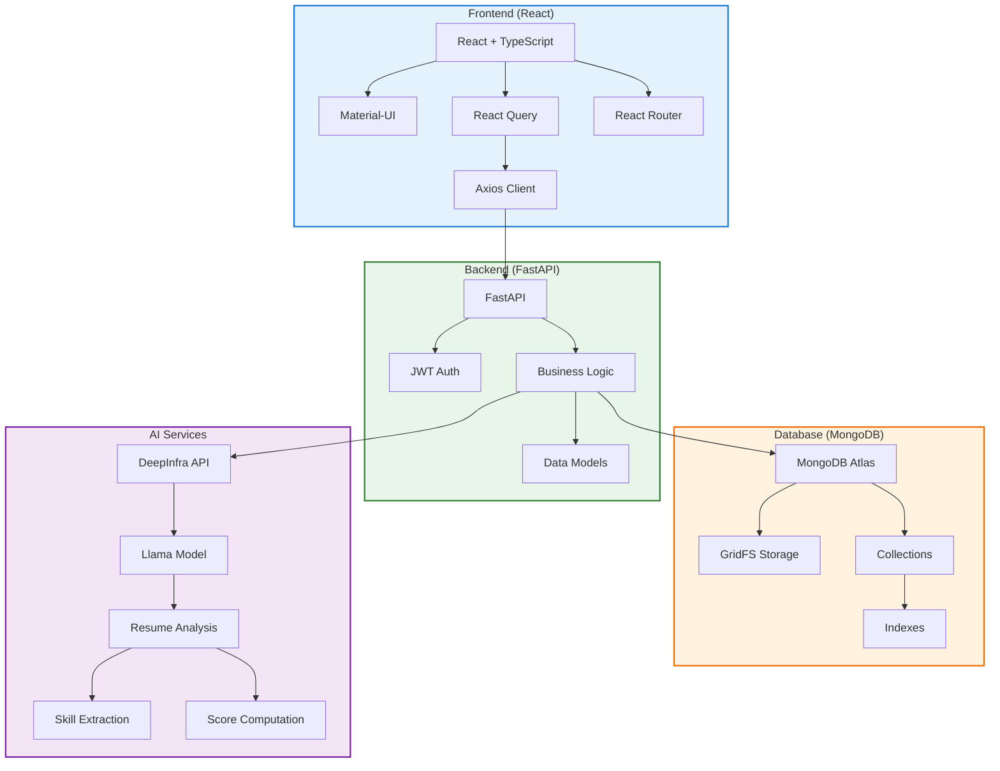

# Architecture Diagram (Mermaid)

You can use this diagram by:
1. Copying it into any markdown file
2. Viewing it on GitHub (which supports Mermaid natively)
3. Using Mermaid Live Editor (https://mermaid.live)
4. Using any markdown editor that supports Mermaid 