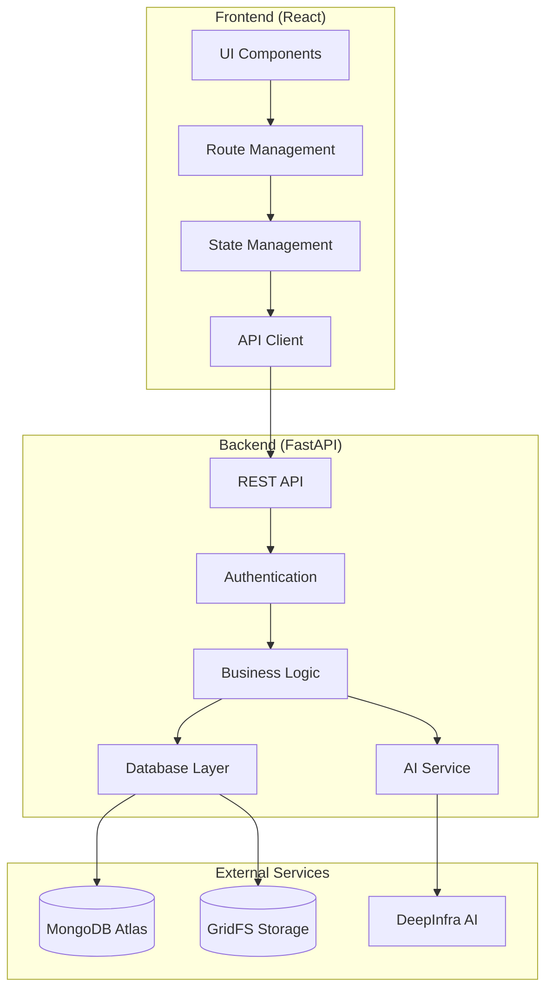

# System Architecture: Talent Sourcing Web Application

## High-Level Architecture



## Component Architecture

### Frontend Architecture

1. **Presentation Layer**
   - React Components (TypeScript)
   - Material-UI for styling
   - Responsive layouts
   - Theme support (dark/light)

2. **State Management**
   - React Query for server state
   - Local state with React hooks
   - Form state with React Hook Form

3. **Navigation**
   - React Router for routing
   - Protected routes
   - Route-based code splitting

4. **API Integration**
   - Axios for HTTP requests
   - Interceptors for auth and errors
   - Type-safe API client

### Backend Architecture

1. **API Layer**
   - FastAPI framework
   - OpenAPI/Swagger documentation
   - Route handlers
   - Request/Response models

2. **Authentication Layer**
   - JWT token management
   - OAuth2 implementation
   - Password hashing (bcrypt)
   - Role-based access control

3. **Business Logic Layer**
   - Job management
   - Candidate processing
   - Resume analysis
   - Statistics calculation

4. **Data Access Layer**
   - MongoDB async operations
   - GridFS file storage
   - Connection pooling
   - Data models and schemas

5. **AI Integration Layer**
   - DeepInfra API client
   - Resume text extraction
   - Skill analysis
   - Score computation

## Database Design

### Collections

1. **Users Collection**
   ```json
   {
     "_id": ObjectId,
     "email": String,
     "hashed_password": String,
     "full_name": String,
     "is_active": Boolean,
     "is_superuser": Boolean,
     "created_at": DateTime,
     "updated_at": DateTime
   }
   ```

2. **Jobs Collection**
   ```json
   {
     "_id": ObjectId,
     "title": String,
     "description": String,
     "responsibilities": String,
     "requirements": String,
     "total_candidates": Integer,
     "resume_screened": Integer,
     "phone_screened": Integer,
     "created_by_id": ObjectId,
     "created_at": DateTime,
     "updated_at": DateTime
   }
   ```

3. **Candidates Collection**
   ```json
   {
     "_id": ObjectId,
     "job_id": ObjectId,
     "name": String,
     "email": String,
     "phone": String,
     "location": String,
     "resume_file_id": String,
     "skills": Object,
     "resume_score": Float,
     "screening_score": Float,
     "screening_summary": String,
     "created_by_id": ObjectId,
     "created_at": DateTime,
     "updated_at": DateTime
   }
   ```

## Security Architecture

1. **Authentication Flow**
   - Username/password validation
   - JWT token generation
   - Token validation middleware
   - Refresh token mechanism

2. **Authorization Flow**
   - Role checking middleware
   - Resource ownership validation
   - Permission-based access

3. **Data Security**
   - Password hashing
   - Secure file storage
   - Input validation
   - CORS protection

## File Storage Architecture

1. **GridFS Implementation**
   - Chunked file storage
   - Metadata management
   - Efficient retrieval
   - Garbage collection

2. **Resume Processing Pipeline**
   - File upload handling
   - PDF text extraction
   - AI analysis integration
   - Result storage

## API Architecture

1. **RESTful Endpoints**
   - `/api/v1/auth/*` - Authentication endpoints
   - `/api/v1/jobs/*` - Job management
   - `/api/v1/candidates/*` - Candidate management
   - `/api/v1/stats/*` - Statistics and analytics

2. **Request/Response Flow**
   - Request validation
   - Authentication check
   - Business logic execution
   - Response formatting

## Deployment Architecture

1. **Development Environment**
   - Local MongoDB
   - Development servers
   - Hot reloading
   - Debug logging

2. **Production Environment**
   - MongoDB Atlas
   - Production configuration
   - Error handling
   - Performance optimization

## Monitoring and Logging

1. **Application Monitoring**
   - Error tracking
   - Performance metrics
   - User activity logs
   - System health checks

2. **Database Monitoring**
   - Connection pooling
   - Query performance
   - Storage utilization
   - Backup management 